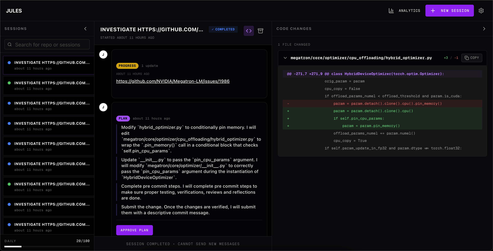

# Jules UI




**A powerful, self-hosted workspace for Google's Jules AI agent.** Transform standard agent interactions into an engineering command center with live code diffs, real-time activity monitoring, session analytics, and comprehensive terminal output inspection.

## ✨ Key Features

- 🔄 **Real-Time Updates** - Live activity feed with auto-polling
- 🤖 **Auto-Pilot (Session Keeper)** - Keep sessions active automatically with smart nudges and plan approvals.
- ⚖️ **Council Debate Mode** - Multi-agent debate system (Architect vs Security) to guide the primary agent.
- 🛡️ **Deep Code Analysis** - Parallel code audits for Security, Performance, and Maintainability.
- 📊 **Code Diff Viewer** - Visualize git patches and changes instantly
- 📁 **Artifact Browser** - Browse and review generated files (diffs, logs, media) with one click.
- 📋 **Kanban Board** - Visual session management (Active, Paused, Completed).
- 💻 **Integrated Terminal** - Full web-based terminal with local machine access
- 📈 **Analytics Dashboard** - Track session metrics and trends
- ⚙️ **System Dashboard** - View submodules, build versions, and project structure.
- 📱 **Mobile-First** - Fully responsive design
- 🔒 **Secure** - Container isolation and API keys stored locally

## 🚀 Quick Start

**Prerequisites:** Node.js 18+ (Node 20+ recommended), `pnpm` (required for workspaces), Jules API key.

### Option 1: Vercel Deployment

Click the button below to deploy your own instance of Jules UI to Vercel:

[](https://vercel.com/new/clone?repository-url=https%3A%2F%2Fgithub.com%2Frobertpelloni%2Fjules-autopilot)

**Environment Variables:**
- `JULES_API_KEY`: Your Jules API key.
- `OPENAI_API_KEY` (Optional): For Council Debate mode.
- `ANTHROPIC_API_KEY` (Optional): For Claude-based analysis.

### Option 2: Local Development

Run the full stack locally:

```bash
# Clone and install
git clone <your-repo-url>
cd jules-ui

# Install dependencies
# Note: We use pnpm workspaces.
npm install -g pnpm
pnpm install

# Start development server
pnpm run dev
```

Open [http://localhost:3000](http://localhost:3000).

### Option 3: Docker Compose

Run the app and terminal server in containers:

```bash
docker-compose -f deploy/docker-compose.yml up
```

Open [http://localhost:3002](http://localhost:3002).

## 🤖 Auto-Pilot (Session Keeper)

The **Session Keeper** is a background utility that ensures your Jules sessions remain active and productive.

*   **Smart Nudges:** Uses a Supervisor LLM (OpenAI, Anthropic, Gemini, etc.) to analyze chat history and send context-aware prompts if the agent becomes inactive.
*   **Plan Approval:** Automatically approves plans generated by the agent to keep the workflow moving.
*   **Council Mode:** Enables a multi-agent debate system where different personas (e.g., "Security Expert", "Performance Engineer") discuss the next step before instructing the agent.
*   **Configurable:** Adjust check intervals, inactivity thresholds (separate for "In Progress" vs "Idle"), and customize fallback messages.

Access these settings via the **Gear Icon** in the top right or the **Logs** panel at the bottom of the screen.

## 🛠️ Architecture

This project is a **monorepo workspace** using `pnpm` and `bun`.

*   `packages/shared`: Shared types, utilities, and core orchestration logic. Built with `tsc` for cross-package usage.
*   `app/`: Main Next.js application (Frontend + API Routes). Deployed to Vercel or Docker.
*   `server/`: Backend services (Session Keeper Daemon). Supports both Node.js (via `@hono/node-server`) and Bun runtimes.
*   `terminal-server/`: Dedicated WebSocket server for the integrated terminal.

### Deployment Notes

- **Vercel:** The project is optimized for Vercel Serverless Functions. The `postinstall` script automatically builds the `@jules/shared` workspace to ensure dependencies are available.
- **Node vs Bun:** While optimized for Bun locally, the server logic includes runtime detection to fallback to standard Node.js on Vercel seamlessly.

## 🔧 Development

```bash
pnpm run dev      # Start dev server (frontend + terminal)
pnpm run build    # Build all workspaces (shared, app, cli)
pnpm run lint     # Run linter
pnpm test         # Run tests (Jest)
```

## 📚 API Integration

Integrates with Jules API (`https://jules.googleapis.com/v1alpha`) for session management, activity streaming, and real-time updates.

## 🤝 Contributing

Contributions welcome! Feel free to submit a Pull Request.

## 📄 License

MIT License - see LICENSE file for details.

---

Built with ❤️ for the Jules Community
